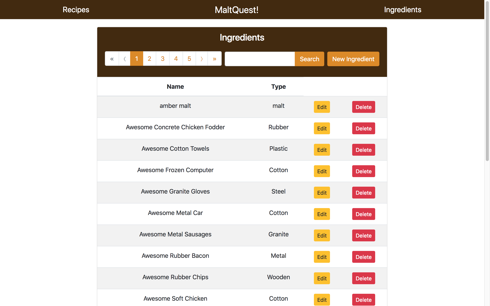
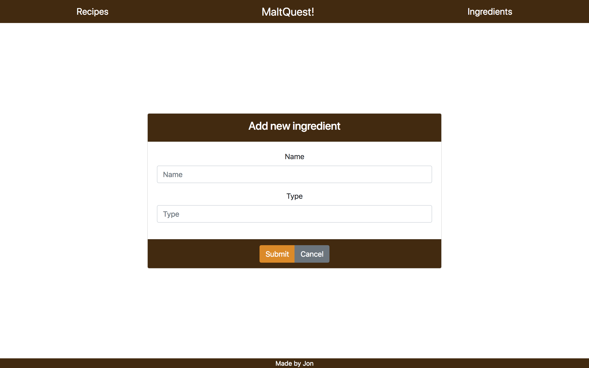
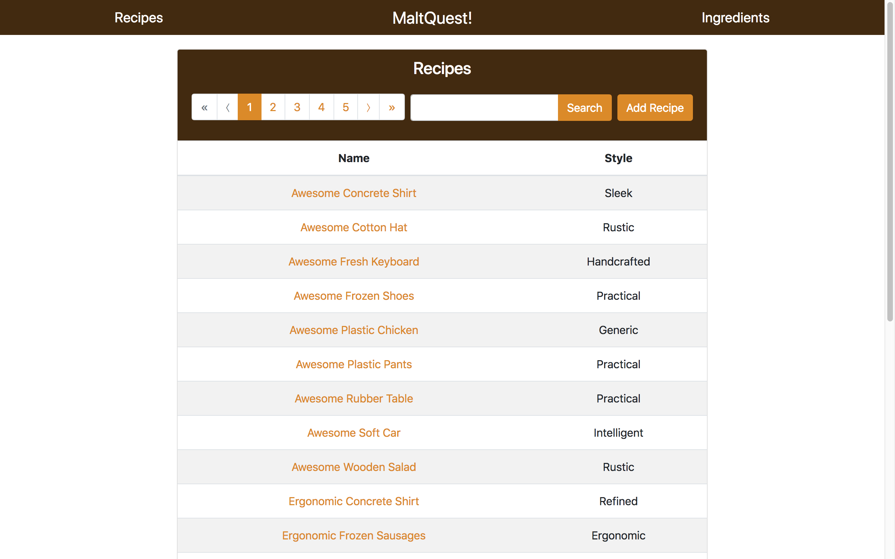
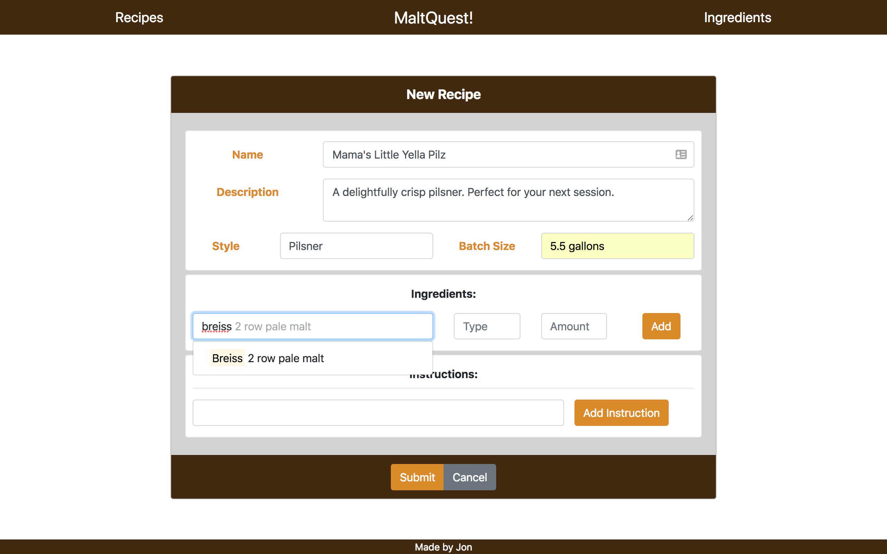
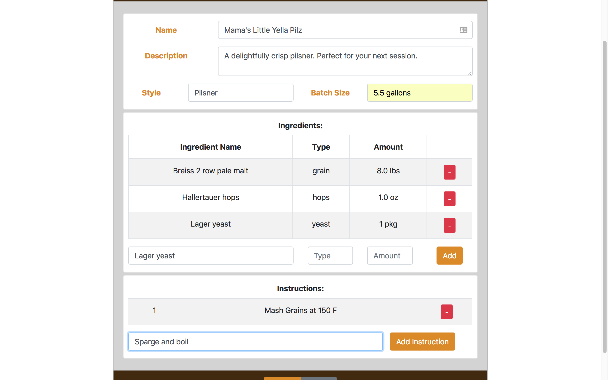
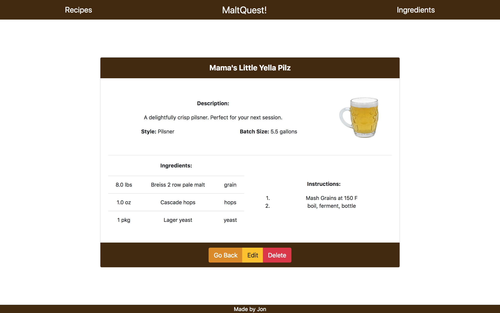

# MaltQuest!

## What is this app?
MaltQuest is an app that allows users to manage homebrewing recipes and ingredients.

## What technologies does MaltQuest use?
MaltQuest is a project that is split into two repositories, the app and the server. The server can be found at: https://github.com/jhlindell/MaltQuest-server

The app uses React as a front end framework. The project was scaffolded using create-react-app. Redux and Thunk are used for state management. For layout and styling, Bootstrap, via the Reactstrap package, flexbox and css are used.

The server uses Node and Express to run the server. The data layer is comprised of Mongo using Mongoose for an ORM and for database access. Faker.js is used to fake the data sets.

## Running the application
Clone both this repository and the above linked MaltQuest-server repository. For the server, you must have MongoDB running locally. use npm install or yarn install to install dependencies. 

Use npm start or yarn start in the server repository to get the server running. Once it is up and running, the data must be initialized. The server runs on localhost:/8000. Using either a browser or Postman, hit the route: localhost:/8000/api/seed_ingredients. Upon success message, follow it up with: localhost:/8000/api/seed_recipes. The ingredients must be run first, as the recipes seed depends on the database to populate ingredients properly.

In the app repository, run npm install or yarn install to install dependencies. Npm start or yarn start gets the project up and running. The app runs on localhost:/3000

## Screenshots and Walkthrough
Upon visiting the website, the user is greeted by the homepage:

If the user clicks on the Ingredients link, they are taken to the ingredients list:

The New Ingredient button takes the user to a screen for entering a new ingredient:

The edit button takes the user to a screen similar to the new ingredient screen that allows the user to edit an ingredient. The delete button deletes said ingredient.

Clicking on the pagination numbers take the user to the corresponding page of the currently loaded ingredient list. Entering a search term, or partial search term in the search box and clicking search queries the database for ingredients that have a match with the search term in their name or type.

Clicking on the Recipes link takes the user to the Recipe list:

As with the ingredients, pagination works for the currently loaded list of recipes. The search box will submit a query over recipe names and recipe type for a full or partial match of the search term.

Clicking the New Recipe button takes the user to the Recipe form:

Typing in the ingredient name field brings up type ahead search for this field. If the ingredient you are looking for is in the database, it will appear in the list populated by the typeahead. If it is a new ingredient, a modal will be triggered to enter the ingredient into the database.

Instructions can be added to the recipe by typing the instruction into the box and clicking the add instruction button:

When the recipe is completed and submit is clicked, the recipe is saved to the database and the user is redirected to the recipe display page:

The edit button will take the user back to the recipe form to adjust the recipe. The delete button will remove the recipe from the database.